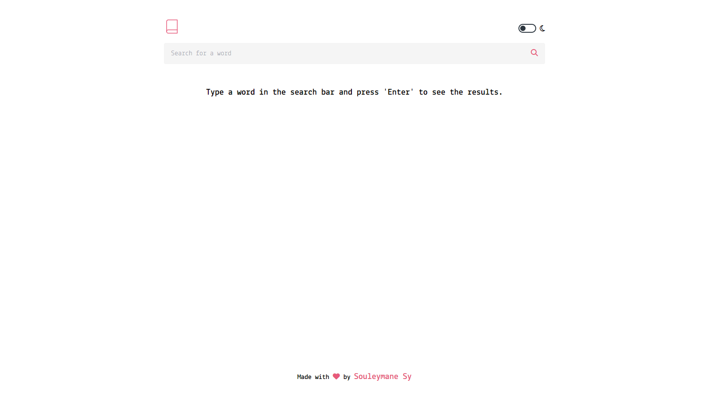
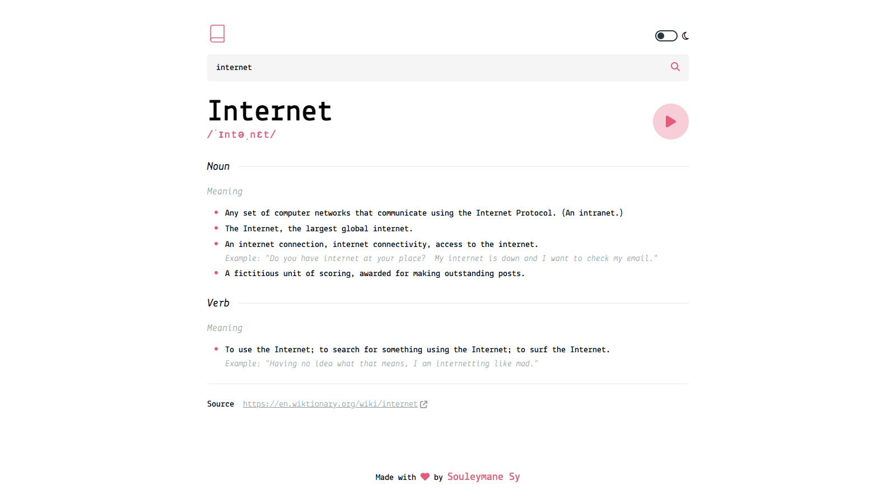
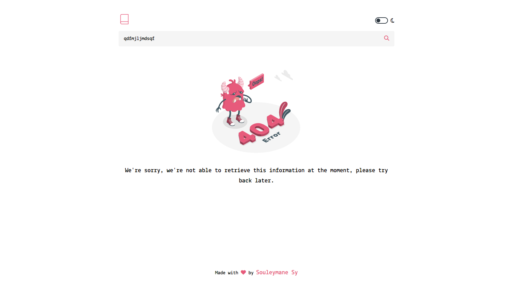

# Dictionary Web App

<div align="center">
  <h3>
    <a href="https://{demo-link.com}" target="_blank">
      Demo URL
    </a>
    <span> | </span>
    <a href="https://dictionaryapi.dev/" target="_blank">
      The Dictionary API Link
    </a>
  </h3>
</div>

## Table of contents

- [Features](#features)
- [Built With](#built-with)
- [Screenshots](#screenshots)
- [Project Structure](#project-structure)
- [Getting Started](#getting-started)
- [Author](#author)
- [Contribution](#contribution)

## Welcome ! 👋

Welcome to the Dictionary Web App project! This project is a Vue.js based web application developed for practice and learning purposes.The app not only provides users with the ability to explore word definitions and meanings but also offers a customizable visual experience with a toggle between light and dark themes.

## Features

- **User-friendly Interface:** The app boasts a clean and intuitive interface designed for a seamless user experience.
- **Fast Loading:** Powered by Vite, the app ensures fast loading times and optimal performance.
- **Modern Vue.js:** Leveraging the Composition API for building efficient and maintainable components.
- **Responsive Design:** Tailwind CSS is employed to create a visually appealing and responsive UI across various devices and screen sizes.
- **Real-time Data:** Axios is utilized for making HTTP requests, enabling the app to fetch data from [The Dictionary API](https://dictionaryapi.dev/).
- **Theme Toggle:** Users can toggle between light and dark themes to customize their visual experience.

## Built With

- **Vue.js:** A progressive JavaScript framework for building user interfaces.
- **Composition API:** A set of additive, function-based APIs for component composition in Vue.js.
- **Vite:** A fast and lightweight frontend build tool that leverages native ES Module imports.
- **Yarn:** A fast, reliable, and secure package manager for JavaScript.
- **Axios:** A promise-based HTTP client for the browser and Node.js, making it easy to send asynchronous HTTP requests.
- **Tailwind CSS:** A utility-first CSS framework for rapid UI development.

## Screenshots



_Figure 1: The homepage provides a simple and elegant search interface for users._



_Figure 2: Users can view detailed word definitions with examples and additional information._



_Figure 3:The user can view an error page for spelling mistakes._


_Figure 4: The user can switch from a light theme to a dark theme._

## Project Structure

```bash
|-- src
|   |-- assets
|   |-- components
|   |-- App.vue
|   |-- main.js
|-- public
|-- package.json
|-- tailwind.config.js
|-- vite.config.js
|-- README.md
```

- **src:** Contains the main source code of the application.
  - **assets:** Stores static assets such as images or fonts.
  - **components:** Contains Vue components used in the project.
  - **App.vue:** The main Vue component.
  - **main.js:** Entry point of the application.
- **public:** Contains static files that are not processed by Vite.
- **package.json:** Configuration file for Yarn, including project dependencies and scripts.
- **tailwind.config.js:** Configuration file for Tailwind CSS.
- **vite.config.js:** Configuration file for Vite, specifying options for the build tool.

## Getting Started

1. **Clone the Repository:**

   ```bash
   git clone https://github.com/SouleymaneSy7/dictionary-web-app.git
   cd dictionary-web-app
   ```

2. **Install Dependencies:**

   ```bash
   yarn install
   ```

3. **Run the Development Server:**

   ```bash
   yarn dev
   ```

4. **Open in Browser:**
   Visit `http://localhost:3000` to experience the app firsthand.

## Author

- GitHub - [Souleymane Sy](https://github.com/SouleymaneSy7)
- Frontend Mentor - [@SouleymaneSy7](https://www.frontendmentor.io/profile/SouleymaneSy7)
- Twitter - [@Souleymanesy43](https://twitter.com/Souleymanesy43)

## Contribution

Contributions are welcome! If you have any suggestions, bug reports, or improvements, feel free to create issues or submit pull requests.
